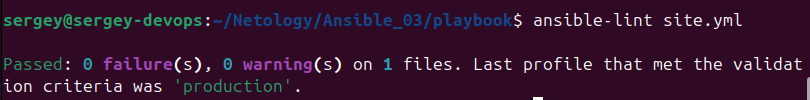
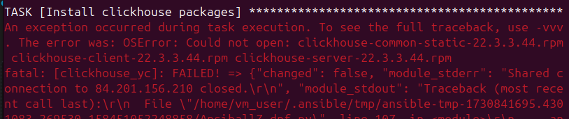
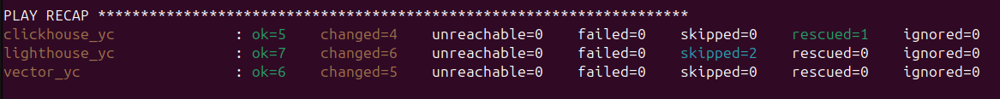
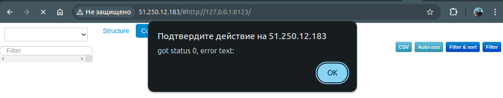
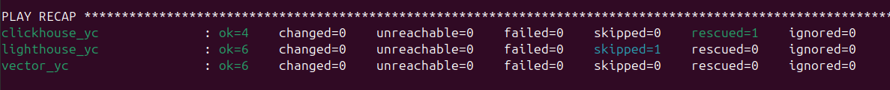

[Задание](https://github.com/netology-code/mnt-homeworks/blob/MNT-video/08-ansible-03-yandex/README.md)
---

1. Допишите playbook: нужно сделать ещё один play, который устанавливает и настраивает LightHouse.
2. При создании tasks рекомендую использовать модули: `get_url`, `template`, `yum`, `apt`.
3. Tasks должны: скачать статику LightHouse, установить Nginx или любой другой веб-сервер, настроить его конфиг для открытия LightHouse, запустить веб-сервер.
##### **Ответ**
- В [`site.yml`](playbook/site.yml) дописана часть **Lighthouse with Nginx**
---
4. Подготовьте свой inventory-файл `prod.yml`.
##### **Ответ**
- Для тестов в контейнерах есть файл [`containers.yml`](playbook/inventory/containers.yml)
- Для `prod` файл генерируется из [hosts.tftpl](prepare_hosts_yc/hosts.tftpl) запуском `terraform apply` в директории `prepare_hosts_yc`
---
5. Запустите `ansible-lint site.yml` и исправьте ошибки, если они есть.
##### **Ответ**
- Ошибки исправлены:  

---
6. Попробуйте запустить playbook на этом окружении с флагом `--check`.
##### **Ответ**
- Check провален, т.к. неоткуда устанавливать (файлы не скачались):

---
7. Запустите playbook на `prod.yml` окружении с флагом `--diff`. Убедитесь, что изменения на системе произведены.
##### **Ответ**
- 
- Проверяем открытие сайта:  
- 
---
8. Повторно запустите playbook с флагом `--diff` и убедитесь, что playbook идемпотентен.
##### **Ответ**
- 
---
9. Подготовьте README.md-файл по своему playbook. В нём должно быть описано: что делает playbook, какие у него есть параметры и теги.
##### **Ответ**
[README.md](README.md)
---
10. Готовый playbook выложите в свой репозиторий, поставьте тег `08-ansible-03-yandex` на фиксирующий коммит, в ответ предоставьте ссылку на него.
